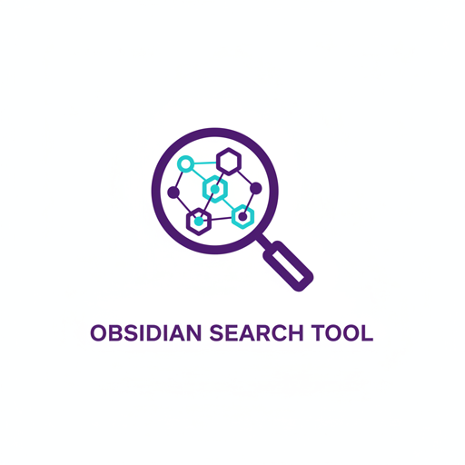

<div align="center">
  
</div>

# Obsidian Search Tool

[](https://github.com/dnvriend/obsidian-search-tool/actions/workflows/ci.yml)
[](https://www.python.org/downloads/)
[](https://opensource.org/licenses/MIT)
[](https://github.com/astral-sh/ruff)
[](https://github.com/python/mypy)
[](https://www.anthropic.com/claude)
[](https://www.anthropic.com/claude/code)

A CLI tool that searches an Obsidian vault through the Obsidian Local REST API using Dataview Query Language (DQL) - TABLE queries only - and JsonLogic queries.

## Table of Contents

- [About](#about)
- [Use Cases](#use-cases)
- [Features](#features)
- [Prerequisites](#prerequisites)
- [Installation](#installation)
- [Configuration](#configuration)
- [Usage](#usage)
- [Library Usage](#library-usage)
- [API Limitations and Known Issues](#api-limitations-and-known-issues)
- [Development](#development)
- [Resources](#resources)
- [License](#license)

## About

### What is Obsidian Search Tool?

`obsidian-search-tool` is a command-line interface for searching through [Obsidian](https://obsidian.md/) vaults using the [Obsidian Local REST API](https://github.com/coddingtonbear/obsidian-local-rest-api) plugin. It provides **search-only** operations using:

- **Dataview DQL**: TABLE queries with powerful filtering, sorting, and grouping
- **JsonLogic**: JSON-based programmatic queries for tags, frontmatter, and content

### Why This CLI Tool?

**Agent-Friendly Design** - Built specifically for integration with AI agents (Claude Code), automation pipelines, and reusable building blocks:
- **ReAct Loops**: Structured commands and error messages enable AI agents to reason and act effectively
- **Composable Architecture**: JSON stdout and logs stderr allow easy piping and integration
- **Reusable Building Blocks**: Commands serve as primitives for Claude Code skills, MCP servers, or custom workflows
- **Dual-Mode Operation**: Use as CLI or importable Python library
- **Production Quality**: Type-safe, tested, with comprehensive error handling

## Use Cases

- 📚 **Knowledge Base Management** - Search and organize notes by tags, topics, or metadata
- 💻 **Source Code Intelligence** - Query code snippets and technical documentation
- 🔍 **Semantic Search** - Find notes by content, frontmatter fields, or relationships
- 🎯 **RAG Applications** - Retrieve context for AI-powered applications
- 🤖 **Agent Integration** - Build Claude Code skills and MCP servers for vault access

## Features

- **Search Operations**:
  - Dataview DQL TABLE queries (FROM, WHERE, SORT, LIMIT)
  - JsonLogic queries for programmatic access (content search with "in" operator)
  - Tag search, frontmatter field search, content search, file path search
  - Access to implicit fields (file.name, file.mtime, file.size, file.tags, etc.)
  - **Note**: GROUP BY, FLATTEN not supported by Obsidian Local REST API

- **Multiple Output Formats**:
  - JSON (default) - Machine-readable for automation
  - Markdown text - Human-readable with metadata
  - Pretty-printed tables - Visual inspection of structured data

- **CLI-First Design**:
  - Flat command structure for simplicity
  - Stdin support for piping queries
  - Rich error messages with solutions
  - Comprehensive help with examples

- **Production Quality**:
  - Type-safe with strict mypy
  - Tested with pytest
  - Linted with ruff
  - Comprehensive error handling
  - Environment-based configuration

## Prerequisites

### Required

1. **Obsidian** must be running
2. **[Local REST API](https://github.com/coddingtonbear/obsidian-local-rest-api)** plugin by Adam Coddington installed and enabled
3. **[Dataview](https://github.com/blacksmithgu/obsidian-dataview)** plugin by Michael Brenan installed and enabled
4. **OBSIDIAN_API_KEY** environment variable set with API key from plugin settings
5. Python 3.14+ and [uv](https://github.com/astral-sh/uv) package manager

## Installation

### From Source

```bash
# Clone repository
git clone https://github.com/dnvriend/obsidian-search-tool.git
cd obsidian-search-tool

# Install globally with uv
uv tool install .

# Verify installation
obsidian-search-tool --version
```

### With mise (Recommended for Development)

```bash
cd obsidian-search-tool
mise trust
mise install
uv sync
uv tool install .
```

## Configuration

### Get API Key

1. Open Obsidian
2. Go to Settings → Community Plugins
3. Find "Local REST API" plugin
4. Click plugin settings
5. Copy the API key from the settings page

### Set Environment Variables

```bash
# Required: API key from plugin settings
export OBSIDIAN_API_KEY="your-api-key-here"

# Optional: API base URL (default: http://127.0.0.1:27123)
export OBSIDIAN_BASE_URL="http://127.0.0.1:27123"

# Optional: Request timeout in seconds (default: 30)
export OBSIDIAN_TIMEOUT="30"

# Optional: Enable verbose logging (default: false)
export OBSIDIAN_VERBOSE="false"
```

## Usage

### Quick Start

```bash
# Set API key
export OBSIDIAN_API_KEY="your-api-key-here"

# Check connectivity
obsidian-search-tool status

# Validate authentication
obsidian-search-tool auth

# Search with Dataview DQL (default)
obsidian-search-tool search 'TABLE file.name FROM #project'

# Search with JsonLogic
obsidian-search-tool search --type jsonlogic \\
    '{"in": [{"var": "frontmatter.tags"}, "project"]}'
```

### Status and Authentication

```bash
# Check API connectivity
obsidian-search-tool status

# Check with text output
obsidian-search-tool status --text

# Validate authentication
obsidian-search-tool auth

# Verbose logging
obsidian-search-tool auth --verbose
```

### Dataview DQL Search

```bash
# Basic TABLE query
obsidian-search-tool search 'TABLE file.name FROM #project'

# With WHERE clause and sorting
obsidian-search-tool search \\
    'TABLE file.name, author WHERE author SORT file.mtime DESC'

# Recent notes (modified in last 7 days)
obsidian-search-tool search \\
    'TABLE file.name, file.mtime WHERE file.mtime >= date(today) - dur(7 days) SORT file.mtime DESC'

# Notes with specific field using contains()
obsidian-search-tool search \\
    'TABLE file.name, author WHERE contains(author, "Ben") LIMIT 5'

# Files in specific folder
obsidian-search-tool search \\
    'TABLE file.name, file.folder WHERE contains(file.folder, "ai-ml") LIMIT 5'

# Large files sorted by size
obsidian-search-tool search \\
    'TABLE file.name, file.size WHERE file.size > 10000 SORT file.size DESC'

# Complex query with multiple conditions
obsidian-search-tool search \\
    'TABLE file.name, file.mtime FROM "reference" WHERE file.size > 5000 AND contains(file.tags, "#docs") SORT file.mtime DESC LIMIT 10'

# From stdin
echo 'TABLE file.name FROM #meeting' | obsidian-search-tool search --stdin

# Text output
obsidian-search-tool search 'TABLE file.name' --text

# Table output (best for structured data)
obsidian-search-tool search 'TABLE file.name, status, file.mtime' --table
```

### JsonLogic Search

```bash
# Content search
obsidian-search-tool search --type jsonlogic \\
    '{"in": ["Claude", {"var": "content"}]}'

# File path contains string
obsidian-search-tool search --type jsonlogic \\
    '{"in": ["daily", {"var": "filename"}]}'

# Search by tag
obsidian-search-tool search --type jsonlogic \\
    '{"in": [{"var": "frontmatter.tags"}, "project"]}'

# Multiple tags (AND)
obsidian-search-tool search --type jsonlogic \\
    '{"and": [{"in": [{"var": "frontmatter.tags"}, "project"]}, \\
              {"in": [{"var": "frontmatter.tags"}, "aws"]}]}'

# Has frontmatter field
obsidian-search-tool search --type jsonlogic \\
    '{"exists": {"var": "frontmatter.status"}}'
```

### Output Formats

```bash
# JSON output (default)
obsidian-search-tool search 'TABLE file.name'

# Markdown text output
obsidian-search-tool search 'TABLE file.name' --text

# Pretty-printed table output
obsidian-search-tool search 'TABLE file.name, author' --table
```

## Library Usage

Use as a Python library for programmatic access:

```python
from obsidian_search_tool import ObsidianClient

# Create client (reads environment variables)
client = ObsidianClient()

# Or with explicit configuration
client = ObsidianClient(
    base_url="http://127.0.0.1:27123",
    api_key="your-api-key",
    timeout=30
)

# Check status
status = client.status()
print(f"Connected: {status.status}")

# Validate authentication
auth = client.check_auth()
print(f"Authenticated: {auth.status}")

# Dataview DQL search
response = client.search_dataview('TABLE file.name FROM #project')
if response.success:
    print(f"Found {response.result_count} results")
    for result in response.results:
        print(result)

# JsonLogic search
response = client.search_jsonlogic('{"in": [{"var": "frontmatter.tags"}, "aws"]}')
if response.success:
    print(f"Results: {response.results}")
```

### Error Handling

```python
from obsidian_search_tool import (
    ObsidianClient,
    ObsidianAuthError,
    ObsidianConnectionError,
    ObsidianAPIError,
)

try:
    client = ObsidianClient()
    response = client.search_dataview('TABLE file.name')
except ObsidianAuthError as e:
    print(f"Authentication failed: {e}")
except ObsidianConnectionError as e:
    print(f"Connection error: {e}")
except ObsidianAPIError as e:
    print(f"API error [{e.status_code}]: {e}")
```

## API Limitations and Known Issues

This section documents tested functionality and known limitations of the Obsidian Local REST API.

### ✅ Supported Dataview DQL Features

**Data Commands** (tested and verified):
- ✅ **FROM** - Source selection by tags, folders, files, links
- ✅ **WHERE** - Filtering with all comparison operators
- ✅ **SORT** - Single and multiple field sorting (ASC/DESC)
- ✅ **LIMIT** - Result count restriction

**Functions** (tested and verified):
- ✅ **date()** - Date parsing and construction: `date(today)`, `date("2024-01-01")`
- ✅ **dur()** - Duration construction: `dur(7 days)`, `dur(2 hours)`
- ✅ **contains()** - String/array contains checks
- ✅ **Comparison operators** - `>`, `<`, `>=`, `<=`, `=`, `!=`
- ✅ **Logical operators** - `AND`, `OR`, `!`
- ✅ **Arithmetic** - Date math: `date(today) - dur(7 days)`

**Implicit Fields** (all work correctly):
- ✅ `file.name`, `file.path`, `file.folder`, `file.size`, `file.ext`
- ✅ `file.mtime`, `file.mday`, `file.ctime`, `file.cday`
- ✅ `file.tags`, `file.etags`, `file.inlinks`, `file.outlinks`

### ❌ Unsupported Features

**Dataview DQL Commands:**
- ❌ **GROUP BY** - Returns error: `TABLE WITHOUT ID queries are not supported`
- ❌ **FLATTEN** - Returns error: `TABLE WITHOUT ID queries are not supported`
- ❌ **LIST queries** - Only TABLE queries supported by API
- ❌ **TASK queries** - Only TABLE queries supported by API
- ❌ **CALENDAR queries** - Only TABLE queries supported by API

**JsonLogic Operators:**
- ❌ **startsWith** - Returns error: `Unrecognized operation startsWith`
- ❌ **endsWith** - Returns error: `Unrecognized operation endsWith`
- ✅ **in** operator - Works for content, filename, and frontmatter searches

### 💡 Workarounds

**Folder filtering** (since GROUP BY doesn't work):
```bash
# Use contains() to filter by folder path
obsidian-search-tool search \
    'TABLE file.name, file.folder WHERE contains(file.folder, "reference")'
```

**Path pattern matching** (since startsWith doesn't work):
```bash
# Use JsonLogic "in" operator for substring matching
obsidian-search-tool search --type jsonlogic \
    '{"in": ["daily", {"var": "filename"}]}'
```

**Counting results**:
```bash
# Get count via jq
obsidian-search-tool search 'TABLE file.name FROM "daily"' | jq '.data.results | length'
```

### 🐛 Common Errors

| Error Message | Cause | Solution |
|---------------|-------|----------|
| `OBSIDIAN_API_KEY environment variable is required` | Missing API key | Set `OBSIDIAN_API_KEY` from plugin settings |
| `Connection failed` | Obsidian not running or API plugin disabled | Start Obsidian and enable Local REST API plugin |
| `Only TABLE dataview queries are supported` | Used LIST/TASK/CALENDAR query | Use TABLE queries only |
| `TABLE WITHOUT ID queries are not supported` | Used GROUP BY or FLATTEN | Remove GROUP BY/FLATTEN from query |
| `Unrecognized operation startsWith` | Used unsupported JsonLogic operator | Use `in` operator for substring matching |

## Development

### Setup

```bash
# Clone and install
git clone https://github.com/dnvriend/obsidian-search-tool.git
cd obsidian-search-tool
make install

# Show available commands
make help
```

### Available Make Commands

```bash
make install       # Install dependencies
make format        # Format code with ruff
make lint          # Run linting with ruff
make typecheck     # Run type checking with mypy
make test          # Run tests with pytest
make check         # Run all checks (lint, typecheck, test)
make pipeline      # Full pipeline (format, check, build, install-global)
make build         # Build package
make clean         # Remove build artifacts
```

### Project Structure

```
obsidian-search-tool/
├── obsidian_search_tool/
│   ├── __init__.py         # Public API exports
│   ├── cli.py             # CLI entry point
│   ├── core/              # Core library
│   │   ├── client.py      # ObsidianClient
│   │   └── models.py      # Data models
│   ├── commands/          # CLI commands
│   │   ├── search_commands.py
│   │   └── status_commands.py
│   └── utils.py           # Formatters and logging
├── tests/                 # Test suite
├── pyproject.toml         # Project configuration
├── Makefile              # Development commands
├── README.md             # This file
└── CLAUDE.md             # Developer guide
```

## Resources

### Official Documentation

- [Obsidian](https://obsidian.md/) - Knowledge base application
- [Obsidian Local REST API](https://github.com/coddingtonbear/obsidian-local-rest-api) - REST API plugin
- [Dataview Plugin](https://github.com/blacksmithgu/obsidian-dataview) - Query language for Obsidian
- [JsonLogic](https://jsonlogic.com/) - JSON-based logic expression format

### Related Tools

- [Python SDK](https://github.com/coddingtonbear/python-obsidian-rest) - Python client for Obsidian REST API
- [Dataview Documentation](https://blacksmithgu.github.io/obsidian-dataview/) - Complete Dataview reference

### Reference Files

The `references/` directory contains curated documentation for quick reference:

- **[JsonLogic Search Examples](references/jsonlogic-search-examples.md)** - JsonLogic query patterns and examples
- **[Dataview Query Types](references/dataview-ql-query-types.md)** - TABLE, LIST, TASK, and CALENDAR query types
- **[Dataview Data Commands](references/dataview-ql-data-commands.md)** - FROM, WHERE, SORT, GROUP BY, LIMIT reference
- **[Dataview Functions](references/dataview-ql-functions.md)** - Complete function reference for DQL expressions
- **[Dataview Page Metadata](references/dataview-metadata-on-pages.md)** - Available file.* fields and implicit metadata

These files provide offline reference for common query patterns and Dataview capabilities.

## License

This project is licensed under the MIT License - see the [LICENSE](LICENSE) file for details.

## Author

**Dennis Vriend**
- GitHub: [@dnvriend](https://github.com/dnvriend)
- Email: dvriend@ilionx.com

## Acknowledgments

- Built with [Click](https://click.palletsprojects.com/) for CLI framework
- Built with [Requests](https://requests.readthedocs.io/) for HTTP client
- Built with [Rich](https://rich.readthedocs.io/) for terminal formatting
- Developed with [uv](https://github.com/astral-sh/uv) for fast Python tooling
- Type-checked with [mypy](https://mypy.readthedocs.io/)
- Linted and formatted with [ruff](https://github.com/astral-sh/ruff)

---

**Generated with AI**

This project was generated using [Claude Code](https://www.anthropic.com/claude/code), an AI-powered development tool by [Anthropic](https://www.anthropic.com/). Claude Code assisted in creating the project structure, implementation, tests, documentation, and development tooling.

Made with ❤️ using Python 3.14
